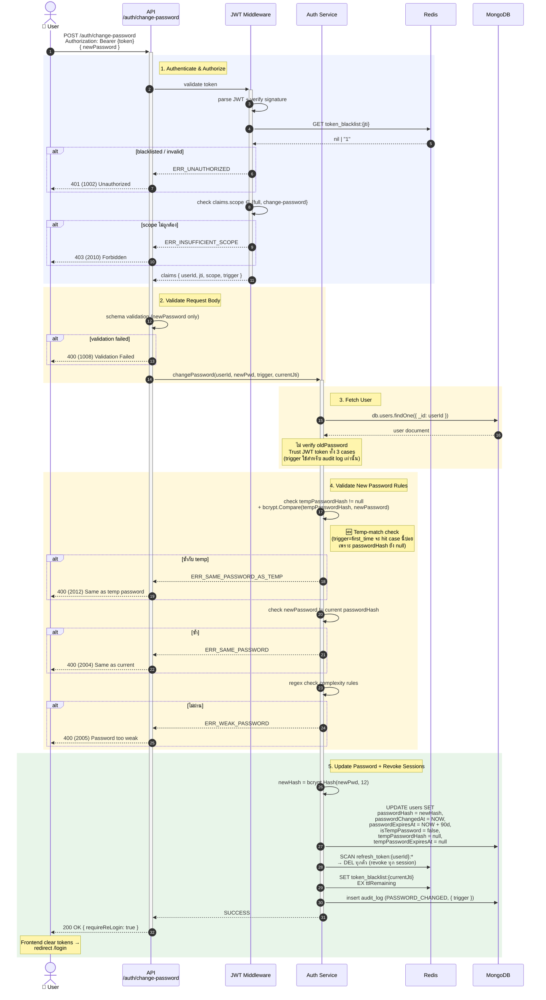

# POST /auth/change-password

เปลี่ยนรหัสผ่าน — รองรับ **2 รูปแบบการเข้าใช้งาน:**

| Trigger | Token Scope | ที่มา |
|---------|-------------|-------|
| `first_time` | `CHANGE_PASSWORD` | จาก `/auth/login` ด้วย **temp password** (Case 1) |
| `expired` | `CHANGE_PASSWORD` | จาก `/auth/login` กรณีรหัสหมดอายุ 90 วัน (Case 3) |

> Backend อ่าน `trigger` claim จาก JWT เพื่อใช้ใน audit log — ทั้ง 2 cases ส่ง body เหมือนกันทุกประการ (`{ newPassword }`) ไม่ต้องส่ง `oldPassword`
>
> 🚫 **ตัด `voluntary` ออก (2026-05-25):** user เปลี่ยนรหัสเอง (ผ่านหน้า Settings) ไม่ได้แล้ว — เปลี่ยนได้เฉพาะตอน login บังคับ (first_time / expired)

**Same-password check:** ทุก trigger เช็คว่า newPassword **ห้ามซ้ำกับ `passwordHash` ปัจจุบัน** (`2004`) และ **ห้ามซ้ำกับ `tempPasswordHash`** ถ้ามี (`2012`)

> 🚫 **ตัด Password history check ออก (2026-05-25):** ไม่เก็บ + ไม่ check `previousPasswordHash` แล้ว — เช็คซ้ำเฉพาะ `passwordHash` ปัจจุบัน (code `2004`); error code `2011` comment ไว้ใน [`error-codes.md`](../error-codes.md#sheet-2--auth--session-2xxx)

หลังเปลี่ยนสำเร็จจะ **revoke tokens ทั้งหมด** และบังคับ re-login

---

## 1. Flowchart

```mermaid
flowchart TD
    Start([Client POST /auth/change-password]) --> AuthHeader{มี Bearer token?}
    AuthHeader -- ไม่มี --> R401N[/"401 (1001)<br/>Unauthorized"/]:::err

    AuthHeader -- มี --> ParseJWT{Parse + verify JWT<br/>+ ไม่อยู่ใน blacklist}
    ParseJWT -- invalid --> R401I[/"401 (1002)<br/>Invalid token"/]:::err

    ParseJWT -- valid --> CheckScope{scope ∈<br/>full / change-password?}
    CheckScope -- ไม่ใช่ --> R403[/"403 (2010)<br/>Token scope ไม่ถูกต้อง"/]:::err

    CheckScope -- OK --> ReadTrigger[อ่าน trigger claim<br/>จาก JWT<br/><i>(ใช้สำหรับ audit log เท่านั้น)</i>]

    ReadTrigger --> ValidateBody{Validate body<br/>newPassword only}
    ValidateBody -- ไม่ผ่าน --> R400V[/"400 (1008)<br/>Validation Failed"/]:::err
    ValidateBody -- ผ่าน --> FetchUser

    FetchUser[("MongoDB:<br/>users.findOne { _id }")] --> CheckTemp{tempPasswordHash != null<br/>AND newPassword ตรงกับ<br/>tempPasswordHash?}
    CheckTemp -- ตรง --> R400ST[/"400 (2012)<br/>Same as temp password"/]:::err

    CheckTemp -- ต่าง / ไม่มี temp --> CheckSame{newPassword ตรงกับ<br/>passwordHash ปัจจุบัน?}
    CheckSame -- ตรง --> R400SP[/"400 (2004)<br/>Same as current"/]:::err

    CheckSame -- ต่าง --> Complexity{ผ่าน complexity<br/>rules?}
    Complexity -- ไม่ผ่าน --> R400WP[/"400 (2005)<br/>Password Too Weak"/]:::err

    Complexity -- ผ่าน --> HashNew[bcrypt.hash newPassword<br/>cost 12]
    HashNew --> UpdateDB[("MongoDB UPDATE users SET:<br/>passwordHash = newHash,<br/>passwordChangedAt = NOW,<br/>passwordExpiresAt = NOW + 90d,<br/>isTempPassword = false,<br/>tempPasswordHash = null,<br/>tempPasswordExpiresAt = null")]
    UpdateDB --> RevokeAll[Revoke all sessions<br/>ของ user นี้]
    RevokeAll --> RedisCleanup[(Redis:<br/>SCAN+DEL refresh_token:userId:*<br/>+ blacklist current jti)]
    RedisCleanup --> Audit[Audit: PASSWORD_CHANGED<br/>{ trigger }]
    Audit --> R200[/"200 OK<br/>requireReLogin: true<br/>(บังคับ re-login)"/]:::ok

    classDef err fill:#FADBD8,stroke:#C0392B,color:#641E16
    classDef ok fill:#D5F5E3,stroke:#27AE60,color:#1E8449
```

---

## 2. Sequence Diagram



---

## 3. API Specification

### 3.1 Request

ทั้ง 2 cases (first_time / expired) ส่ง body **เหมือนกันทุกประการ:**

```http
POST /auth/change-password HTTP/1.1
Authorization: Bearer {accessToken}
Content-Type: application/json
```

```json
{
  "newPassword": "NewSecure@Pass2026"
}
```

**Body fields:**
| Field | Type | Required | Validation |
|-------|------|----------|-----------|
| `newPassword` | string | ✅ | ดูข้อ 3.2 ด้านล่าง |

### 3.2 Password Complexity Rules

- ความยาวอย่างน้อย **8 ตัวอักษร** สูงสุด 128
- มี **ตัวพิมพ์ใหญ่** อย่างน้อย 1 ตัว (`A-Z`)
- มี **ตัวพิมพ์เล็ก** อย่างน้อย 1 ตัว (`a-z`)
- มี **ตัวเลข** อย่างน้อย 1 ตัว (`0-9`)
- มี **อักขระพิเศษ** อย่างน้อย 1 ตัว จาก `@$!%*?&`
- ต้อง **ไม่ตรงกับ password ปัจจุบัน** (`passwordHash`)
- ต้อง **ไม่ตรงกับรหัสผ่านชั่วคราว** (`tempPasswordHash`) — เฉพาะเมื่อ `tempPasswordHash != null` (กรณี first-time หรือ admin เพิ่ง reset)

> 🚫 **ตัด Password history check ออก (2026-05-25):** ไม่เก็บ + ไม่ check `previousPasswordHash` แล้ว — เช็คซ้ำเฉพาะ `passwordHash` ปัจจุบัน (code `2004`); error code [`2011 PasswordReuse`](../error-codes.md#sheet-2--auth--session-2xxx) ถูก comment ไว้ (ห้าม recycle)

---

### 3.3 Response — 200 OK

```json
{
  "code": "0000",
  "message": "Password changed successfully. Please log in again.",
  "requestId": "req-...",
  "responseTime": "2026-05-20T11:00:00+07:00",
  "apiVersion": "1.0.0",
  "data": {
    "passwordChangedAt": "2026-05-20T11:00:00+07:00",
    "passwordExpiresAt": "2026-08-18T11:00:00+07:00",
    "requireReLogin": true
  }
}
```

> **Frontend behavior:** clear tokens → redirect `/login`

---

### 3.4 Error Responses

#### 400 (1008) Validation Failed
```json
{ "code": "1008", "error": "validation_failed", "message": "..." }
```

#### 400 (2004) Same as Current Password
> เกิดเมื่อ user (trigger=`expired`) ตั้ง newPassword ตรงกับ `passwordHash` ปัจจุบัน
```json
{ "code": "2004", "error": "same_password", "message": "เนื่องจากรหัสผ่านใหม่ไม่สามารถซ้ำกับรหัสผ่านล่าสุดที่เคยใช้งานได้ กรุณากำหนดรหัสผ่านใหม่อีกครั้ง" }
```

#### 400 (2005) Password Too Weak
```json
{ "code": "2005", "error": "weak_password", "message": "รหัสผ่านไม่ผ่านเงื่อนไขที่กำหนด" }
```

#### 400 (2012) Same as Temp Password
> เกิดเมื่อ user (มักเป็น `trigger=first_time`) ตั้ง newPassword ตรงกับ `tempPasswordHash` ที่ admin gen ให้
```json
{ "code": "2012", "error": "same_password_as_temp", "message": "เนื่องจากรหัสผ่านใหม่ไม่สามารถซ้ำกับรหัสผ่านชั่วคราวได้ กรุณากำหนดรหัสผ่านใหม่อีกครั้ง" }
```

#### 401 (1001/1002/1003) Unauthorized / Invalid / Expired Token
#### 403 (2010) Insufficient Token Scope

---

## 4. Implementation Notes

### 4.1 Audit log metadata

```json
{
  "userId": "6650abc...",
  "username": "700",
  "action": "PASSWORD_CHANGED",
  "ip": "10.0.1.42",
  "metadata": {
    "scope": "CHANGE_PASSWORD",
    "trigger": "first_time",
    "previousChangeAt": null,
    "newExpiresAt": "2026-08-18T11:00:00Z"
  },
  "createdAt": "2026-05-20T11:00:00Z"
}
```

### 4.2 Go Service Signature

```go
type ChangePasswordInput struct {
    UserID      string
    NewPassword string
    Trigger     string  // "first_time" | "expired" — ใช้สำหรับ audit log
    CurrentJTI  string
    IP          string
}

func (s *AuthService) ChangePassword(ctx context.Context, in ChangePasswordInput) error {
    user, err := s.userRepo.FindByID(ctx, in.UserID)
    if err != nil { return err }

    // Check newPassword != tempPasswordHash (BA rule — เน้นกรณี first_time ที่ passwordHash ยัง null)
    if user.TempPasswordHash != nil && bcrypt.CompareHashAndPassword(user.TempPasswordHash, in.NewPassword) == nil {
        return ErrSamePasswordAsTemp
    }

    // Check newPassword != current password
    if user.PasswordHash != nil && bcrypt.CompareHashAndPassword(user.PasswordHash, in.NewPassword) == nil {
        return ErrSamePassword
    }

    // Complexity check
    if !validateComplexity(in.NewPassword) { return ErrWeakPassword }

    // Hash + update
    newHash := bcrypt.Hash(in.NewPassword, 12)
    update := bson.M{
        "passwordHash":           newHash,
        "passwordChangedAt":      time.Now(),
        "passwordExpiresAt":      time.Now().AddDate(0, 3, 0),
        "isTempPassword":         false,
        "tempPasswordHash":       nil,
        "tempPasswordExpiresAt":  nil,
    }
    s.userRepo.Update(ctx, in.UserID, update)

    // Revoke all sessions
    s.revokeAllSessions(ctx, in.UserID)
    s.blacklistToken(ctx, in.CurrentJTI)

    s.audit(ctx, in.UserID, user.Username, "PASSWORD_CHANGED", in.IP, in.Trigger)
    return nil
}
```

### 4.3 Password history — _(ยกเลิก 2026-05-25)_

> 🚫 **เลิกใช้:** ตัด field `previousPasswordHash` ออกจาก MongoDB schema + ตัด rotate logic — Backend check ซ้ำเฉพาะ `passwordHash` ปัจจุบัน (code `2004 SamePassword`)
>
> Error code `2011 PasswordReuse` ถูก comment ไว้ใน [`error-codes.md`](../error-codes.md#sheet-2--auth--session-2xxx) (ห้าม recycle)
>
> เดิม rule นี้ตั้งใจป้องกัน user เปลี่ยนรหัสสลับไปมาเลี่ยง expiry 90 วัน — business ตัดสินใจไม่บังคับแล้ว
