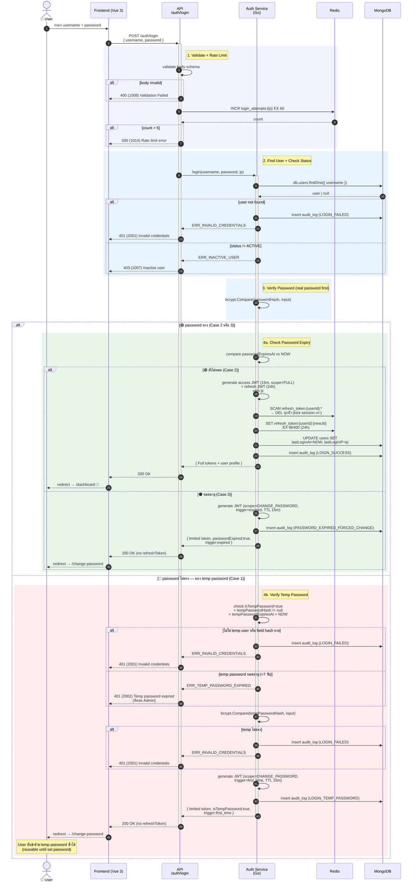

# POST /auth/login — 3 Cases

โมดูล Login ของ Pentor Leasing BO รวม 3 entry points ในไฟล์เดียว — endpoint เดียว (`POST /auth/login`) ตรวจสอบและ branch ตาม state ของ user

| Case | สถานการณ์ | Input | Response |
|------|----------|-------|----------|
| **1** | **First-time login** (Super Admin สร้าง user) | `username` + **temp password** (จาก email) | `200` + JWT scope `CHANGE_PASSWORD`, trigger `first_time` (TTL 15m, ไม่มี refresh) |
| **2** | **Normal login** | `username` + password | `200` + Full tokens (access 15m + refresh 24h, scope `FULL`) |
| **3** | **Password expired** (90 วัน) | `username` + password | `200` + JWT scope `CHANGE_PASSWORD`, trigger `expired` (TTL 15m, ไม่มี refresh) |

> **Case 1 + Case 3 convergence:** ทั้งสองได้ limited-scope token → ใช้ `POST /auth/change-password` set password ใหม่ → ระบบ revoke tokens ทั้งหมด → กลับไป login ใหม่ → Case 2

---

## 1. Master Flowchart — All 3 Cases

```mermaid
flowchart TD
    Start([User เข้าหน้า Login]) --> Form[กรอก username + password]
    Form --> CallAPI[/"POST /auth/login<br/>{ username, password }"/]

    CallAPI --> ValidateBody{Validate body}
    ValidateBody -- ไม่ผ่าน --> R400V[/"400 (1008)<br/>Validation Failed"/]:::err

    ValidateBody -- ผ่าน --> RateLimit{Rate limit<br/>OK?<br/>5 req/min/IP}
    RateLimit -- เกิน --> R429[/"500 (1014)<br/>Rate limit error"/]:::err

    RateLimit -- OK --> FindUser[("MongoDB:<br/>users.findOne<br/>{ username }")]
    FindUser --> UserExists{พบ user?}
    UserExists -- ไม่พบ --> Audit1[Audit: LOGIN_FAILED]
    Audit1 --> R401NF[/"401 (2001)<br/>Invalid credentials"/]:::err

    UserExists -- พบ --> StatusActive{status == ACTIVE?}
    StatusActive -- ไม่ --> R403IA[/"403 (1007)<br/>Inactive user"/]:::err

    StatusActive -- ACTIVE --> CheckReal{bcrypt.compare<br/>password vs<br/>passwordHash}

    CheckReal -- ตรง --> CheckExpiry{passwordExpiresAt<br/>≤ NOW?}

    CheckExpiry -- ยังไม่หมด<br/>(Case 2) --> GenFull[Generate JWT pair<br/>access 15m scope=FULL<br/>+ refresh 24h]
    GenFull --> SingleSession[Redis: SCAN+DEL<br/>refresh_token:userId:*<br/>(เตะ session เก่า)]
    SingleSession --> StoreNew[Redis SET<br/>refresh_token:userId:newJti<br/>EX 86400]
    StoreNew --> UpdateLast[("MongoDB UPDATE:<br/>lastLoginAt = NOW")]
    UpdateLast --> Audit2[Audit: LOGIN_SUCCESS]
    Audit2 --> R200S[/"200 Full tokens<br/>+ user profile"/]:::ok

    CheckExpiry -- หมดอายุ<br/>(Case 3) --> GenLimitedExp[Generate JWT<br/>scope=CHANGE_PASSWORD<br/>trigger=expired<br/>TTL 15m<br/>(ไม่มี refresh)]
    GenLimitedExp --> Audit3[Audit:<br/>PASSWORD_EXPIRED_FORCED_CHANGE]
    Audit3 --> R200E[/"200 OK<br/>passwordExpired: true<br/>tokenScope: CHANGE_PASSWORD<br/>trigger: expired"/]:::warn

    CheckReal -- ไม่ตรง --> CheckTemp{มี tempPasswordHash<br/>+ isTempPassword=true<br/>+ ยังไม่หมดอายุ 7 วัน?}

    CheckTemp -- ไม่ใช่ --> CheckTempExpired{tempPasswordHash<br/>หมดอายุ?}
    CheckTempExpired -- หมด --> R401TE[/"401 (2002)<br/>Temp password expired"/]:::err
    CheckTempExpired -- ไม่มี / ไม่ใช่ temp user --> Audit4[Audit: LOGIN_FAILED]
    Audit4 --> R401WP[/"401 (2001)<br/>Invalid credentials"/]:::err

    CheckTemp -- valid --> MatchTemp{bcrypt.compare<br/>password vs<br/>tempPasswordHash}
    MatchTemp -- ไม่ตรง --> Audit4
    MatchTemp -- ตรง<br/>(Case 1) --> GenLimitedFirst[Generate JWT<br/>scope=CHANGE_PASSWORD<br/>trigger=first_time<br/>TTL 15m<br/>(ไม่มี refresh)]
    GenLimitedFirst --> Audit5[Audit:<br/>LOGIN_TEMP_PASSWORD]
    Audit5 --> R200F[/"200 OK<br/>isTempPassword: true<br/>tokenScope: CHANGE_PASSWORD<br/>trigger: first_time"/]:::warn

    classDef err fill:#FADBD8,stroke:#C0392B,color:#641E16
    classDef warn fill:#FCF3CF,stroke:#E67E22,color:#7E5109
    classDef ok fill:#D5F5E3,stroke:#27AE60,color:#1E8449
```

---

## 2. Master Sequence Diagram — All 3 Cases



---

## 3. API Specification

### 3.1 Request

```http
POST /auth/login HTTP/1.1
Content-Type: application/json
```

```json
{
  "username": "700",
  "password": "Aa123456*"
}
```

| Field | Type | Required | Description |
|-------|------|----------|-------------|
| `username` | string | ✅ | Username ของ employee (เช่น รหัสพนักงาน) |
| `password` | string | ✅ | Password หรือ Temp password |

---

### 3.2 Response 200 — Case 2 (Normal Login)

```json
{
  "code": "0000",
  "message": "Login successful",
  "requestId": "req-...",
  "responseTime": "2026-05-20T10:30:00+07:00",
  "apiVersion": "1.0.0",
  "data": {
    "accessToken": "eyJhbGciOiJIUzI1NiI...",
    "refreshToken": "eyJhbGciOiJIUzI1NiI...",
    "tokenScope": "FULL",
    "expiresIn": 900,
    "isTempPassword": false,
    "passwordExpired": false,
    "passwordExpiresAt": "2026-08-10T08:00:00+07:00",
    "user": {
      "id": "6650abc1234567890def0001",
      "username": "700",
      "employeeCode": "700",
      "email": "suwimol.rak@example.com",
      "firstName": "สุวิมล",
      "lastName": "รักษาสัตย์",
      "roleCode": "sale_mng",
      "status": "ACTIVE",
      "lastLoginAt": "2026-05-19T18:42:00+07:00"
    }
  }
}
```

**Frontend behavior:** เก็บ tokens → redirect ไปหน้า `/dashboard`

---

### 3.3 Response 200 — Case 1 (First-time, Temp Password)

```json
{
  "code": "0000",
  "message": "Please set your new password",
  "requestId": "req-...",
  "responseTime": "2026-05-20T10:30:00+07:00",
  "apiVersion": "1.0.0",
  "data": {
    "accessToken": "eyJhbGciOiJIUzI1NiI...",
    "tokenScope": "CHANGE_PASSWORD",
    "trigger": "first_time",
    "expiresIn": 900,
    "isTempPassword": true,
    "tempPasswordExpiresAt": "2026-05-27T10:00:00+07:00"
  }
}
```

> **ไม่มี `refreshToken`** — บังคับให้ set password ก่อน
> **Frontend behavior:** เก็บ accessToken ใน memory → redirect `/change-password?mode=first-time`

---

### 3.4 Response 200 — Case 3 (Password Expired)

```json
{
  "code": "0000",
  "message": "Password expired — please change your password",
  "requestId": "req-...",
  "responseTime": "2026-05-20T10:30:00+07:00",
  "apiVersion": "1.0.0",
  "data": {
    "accessToken": "eyJhbGciOiJIUzI1NiI...",
    "tokenScope": "CHANGE_PASSWORD",
    "trigger": "expired",
    "expiresIn": 900,
    "isTempPassword": false,
    "passwordExpired": true,
    "passwordExpiredAt": "2026-05-10T08:00:00+07:00"
  }
}
```

> **ไม่มี `refreshToken`** — บังคับให้เปลี่ยนรหัสก่อน
> **Frontend behavior:** redirect `/change-password?mode=expired`

---

### 3.5 JWT Payload Reference

JWT ที่ออกจาก `/auth/login` ทุก case ใช้ algorithm **HS256** + standard claims (`iss` / `aud` / `sub` / `iat` / `exp` / `jti`) + custom claims (`scope` / `trigger` / `user`)

> **Backend อ่าน `claims.scope` ที่ middleware ของ `/auth/change-password`** (ดู [change-password.md ข้อ 2](./change-password.md#2-sequence-diagram)) เพื่อ allow `scope ∈ {"FULL", "CHANGE_PASSWORD"}` — scope อื่นตอบ `403 (2010)`
>
> **`user` claim** mirror schema ของ [`GET /profile/me`](../profile/get-me.md) — FE decode JWT แล้วใช้ data ได้ทันที โดยไม่ต้องเรียก `/profile/me` ตอน mount

#### 3.5.1 Case 1 — First-time (Temp Password)

```json
{
  "sub": "6650abc1234567890def0001",
  "jti": "01HXYZ7K8N3M2P4Q5R6S7T8U9V",
  "iss": "pentor-leasing-bo",
  "aud": "pentor-leasing-bo-api",
  "iat": 1748151000,
  "exp": 1748151900,
  "scope": "CHANGE_PASSWORD",
  "trigger": "first_time",
  "user": {
    "id": "6650abc1234567890def0001",
    "employeeCode": "700",
    "firstName": "สุวิมล",
    "lastName": "รักษาสัตย์",
    "roleCodes": ["SALE_MNG"],
    "permissions": [
      "auth.changePassword"
    ]
  }
}
```

- TTL **15 นาที** (`exp - iat = 900`)
- **ไม่มี refresh token** → set password แล้วบังคับ re-login
- `user.permissions` อาจถูก limit เฉพาะ permission ที่ใช้ในหน้า change-password (กันเรียก endpoint อื่น ก่อน set password ใหม่)

#### 3.5.2 Case 2 — Normal Login (Full Tokens)

**Access token:**

```json
{
  "sub": "6650abc1234567890def0001",
  "jti": "01HXYZ8L9N4M3P5Q6R7S8T9U0V",
  "iss": "pentor-leasing-bo",
  "aud": "pentor-leasing-bo-api",
  "iat": 1748151000,
  "exp": 1748151900,
  "scope": "FULL",
  "user": {
    "id": "6650abc1234567890def0001",
    "employeeCode": "700",
    "firstName": "สุวิมล",
    "lastName": "รักษาสัตย์",
    "roleCodes": ["SALE_MNG"],
    "permissions": [
      "user.user.view",
      "user.user.edit",
      "application.view",
      "application.approve"
    ]
  }
}
```

- TTL **15 นาที** (`exp - iat = 900`)
- ไม่มี `trigger` (เฉพาะ scope=`CHANGE_PASSWORD` ที่ใช้)
- `user.permissions[]` คือ snapshot ตอน issue — ถ้า Admin แก้ permission ระหว่าง session จะค้าง permission เก่าจนกว่า token หมดอายุ (≤15m) — FE อยากได้ live ต้องเรียก [`GET /profile/me`](../profile/get-me.md) แทน

**Refresh token (no `user` object):**

```json
{
  "sub": "6650abc1234567890def0001",
  "jti": "01HXYZ8L9N4M3P5Q6R7S8T9U0W",
  "type": "refresh",
  "iss": "pentor-leasing-bo",
  "aud": "pentor-leasing-bo-api",
  "iat": 1748151000,
  "exp": 1748237400
}
```

- TTL **24 ชั่วโมง** (`exp - iat = 86400`)
- เก็บใน Redis key `refresh_token:{sub}:{jti}` (ดู [README ข้อ 2.1](./README.md#21-session-strategy-jwt--redis-blacklist--single-session))
- One-time use — rotate ทุกครั้งที่ refresh
- **ไม่มี `user` claim** เพื่อลด token size + ลด attack surface กรณี refresh ถูกขโมย (decode แล้วไม่ได้ข้อมูล user)

#### 3.5.3 Case 3 — Password Expired

```json
{
  "sub": "6650abc1234567890def0001",
  "jti": "01HXYZ7K8N3M2P4Q5R6S7T8U9X",
  "iss": "pentor-leasing-bo",
  "aud": "pentor-leasing-bo-api",
  "iat": 1748151000,
  "exp": 1748151900,
  "scope": "CHANGE_PASSWORD",
  "trigger": "expired",
  "user": {
    "id": "6650abc1234567890def0001",
    "employeeCode": "700",
    "firstName": "สุวิมล",
    "lastName": "รักษาสัตย์",
    "roleCodes": ["SALE_MNG"],
    "permissions": [
      "auth.changePassword"
    ]
  }
}
```

- TTL **15 นาที** (`exp - iat = 900`)
- โครงสร้างเหมือน Case 1 — ต่างที่ `trigger=expired` (Case 1 ใช้ `first_time`)

#### 3.5.4 Claim Reference

| Claim | Type | Required | Notes |
|-------|------|----------|-------|
| `sub` | string | ✅ | user `_id` (ObjectId hex) — duplicate กับ `user.id` เพื่อตรง JWT convention |
| `jti` | ULID/UUID | ✅ | สำหรับ Redis blacklist + refresh token tracking |
| `iss` | string | ✅ | issuer fixed = `"pentor-leasing-bo"` |
| `aud` | string | ✅ | audience fixed = `"pentor-leasing-bo-api"` |
| `iat` | int (Unix epoch) | ✅ | issued at |
| `exp` | int (Unix epoch) | ✅ | expiry — 15m สำหรับ access / 24h สำหรับ refresh |
| `scope` | string | ✅ (access) | `"FULL"` หรือ `"CHANGE_PASSWORD"` — middleware ใช้ตัดสินสิทธิ์ |
| `trigger` | string | เฉพาะ scope=`CHANGE_PASSWORD` | `"first_time"` หรือ `"expired"` — ใช้สำหรับ audit log |
| `type` | string | เฉพาะ refresh token | `"refresh"` — distinguish จาก access |
| `user` | object | ✅ (access) | embedded user model — mirror schema ของ [`GET /profile/me`](../profile/get-me.md) |
| `user.id` | string | ✅ | user `_id` (เหมือน `sub`) |
| `user.employeeCode` | string | ✅ | รหัสพนักงาน |
| `user.firstName` | string | ✅ | ชื่อจริง (ภาษาไทย) |
| `user.lastName` | string | ✅ | นามสกุล (ภาษาไทย) |
| `user.roleCodes` | array of string | ✅ | UPPER_SNAKE role codes (1 user อาจมีหลาย role) |
| `user.permissions` | array of string | ✅ | permission strings (เช่น `"user.user.view"`) — snapshot ตอน issue |

> **Snapshot vs DB lookup:** `user` object ใส่ใน JWT เพื่อให้ middleware + FE ไม่ต้อง query MongoDB ทุก request — แต่ถ้า role/permission ของ user เปลี่ยน ต้องรอ token หมดอายุ (≤15m) หรือ revoke ด้วยการ blacklist `jti` (forcing re-login). FE ที่อยาก live data → เรียก [`GET /profile/me`](../profile/get-me.md)

---

### 3.6 Error Responses

#### 400 (1008) Validation Failed
```json
{
  "code": "1008",
  "error": "validation_failed",
  "message": "Username is required",
  "errorData": [{ "field": "username", "tag": "required", "reason": "username is required" }]
}
```

#### 401 (2001) Invalid Credentials
> ใช้ message เดียวกันทั้งกรณี user ไม่พบ และ password ผิด (ป้องกัน user enumeration)
```json
{
  "code": "2001",
  "error": "invalid_credentials",
  "message": "Invalid username or password",
  "errorData": []
}
```

#### 401 (2002) Temp Password Expired
> เกิดเมื่อ temp password หมดอายุ (>7 วัน) แต่ user ยังไม่ set password
```json
{
  "code": "2002",
  "error": "temp_password_expired",
  "message": "รหัสผ่านชั่วคราวหมดอายุ (7 วัน) กรุณาติดต่อผู้ดูแลระบบเพื่อขอรหัสใหม่",
  "errorData": []
}
```

#### 403 (1007) Inactive User
```json
{
  "code": "1007",
  "error": "inactive_user",
  "message": "บัญชีนี้ถูกปิดการใช้งาน กรุณาติดต่อผู้ดูแลระบบ",
  "errorData": []
}
```

#### 500 (1014) Rate Limit Error
```json
{
  "code": "1014",
  "error": "rate_limit_error",
  "message": "Too many login attempts. Please try again in 1 minute.",
  "errorData": []
}
```

---

## 4. Implementation Notes (Go)

### 4.1 Service Method

```go
type LoginInput struct {
    Username string
    Password string
    IP       string
    UserAgent string
}

type LoginOutput struct {
    AccessToken           string
    RefreshToken          string   // empty when Case 1/3
    TokenScope            string   // "FULL" | "CHANGE_PASSWORD"
    Trigger               string   // "" | "first_time" | "expired"
    ExpiresIn             int      // 900
    IsTempPassword        bool
    PasswordExpired       bool
    PasswordExpiresAt     *time.Time
    TempPasswordExpiresAt *time.Time
    User                  *UserProfile  // nil when Case 1/3
}

func (s *AuthService) Login(ctx context.Context, in LoginInput) (*LoginOutput, error) {
    user, err := s.userRepo.FindByUsername(ctx, in.Username)
    if err != nil || user == nil {
        s.audit(ctx, "", in.Username, "LOGIN_FAILED", in.IP, "user_not_found")
        return nil, ErrInvalidCredentials
    }

    if user.Status != "ACTIVE" {
        return nil, ErrInactiveUser
    }

    // 1. Try real password
    if user.PasswordHash != nil && bcrypt.CompareHashAndPassword(user.PasswordHash, in.Password) == nil {
        // Check expiry
        if time.Now().After(user.PasswordExpiresAt) {
            return s.issueLimitedToken(ctx, user, "expired")  // Case 3
        }
        return s.issueFullTokens(ctx, user, in.IP)  // Case 2
    }

    // 2. Try temp password (Case 1)
    if user.IsTempPassword && user.TempPasswordHash != nil {
        if time.Now().After(*user.TempPasswordExpiresAt) {
            return nil, ErrTempPasswordExpired
        }
        if bcrypt.CompareHashAndPassword(user.TempPasswordHash, in.Password) == nil {
            return s.issueLimitedToken(ctx, user, "first_time")
        }
    }

    // 3. No match
    s.audit(ctx, user.ID, user.Username, "LOGIN_FAILED", in.IP, "wrong_password")
    return nil, ErrInvalidCredentials
}
```

### 4.2 Single-Session Kick (in `issueFullTokens`)

```go
// 1. SCAN existing refresh tokens for this user
iter := s.redis.Scan(ctx, 0, fmt.Sprintf("refresh_token:%s:*", user.ID), 100).Iterator()
for iter.Next(ctx) {
    s.redis.Del(ctx, iter.Val())
    s.audit(ctx, user.ID, user.Username, "SESSION_KICKED", in.IP, "new_login")
}

// 2. Issue new token + store
newJTI := uuid.New().String()
refreshKey := fmt.Sprintf("refresh_token:%s:%s", user.ID, newJTI)
s.redis.Set(ctx, refreshKey, sessionData, 24*time.Hour)
```

### 4.3 Edge Cases

| Scenario | Behavior |
|----------|---------|
| User login ด้วย temp password ครั้งที่ 1 → ปิด browser → login ครั้งที่ 2 | ✅ ใช้ temp password เดิมได้ (reusable until set password) |
| User login ด้วย temp password → set password → temp password เดิม | ❌ ใช้ไม่ได้ (tempPasswordHash = null หลัง set) |
| 2 users login ด้วย account เดียวกัน | ✅ Latest login เตะ previous session (single-session kick) |
| Login ด้วย temp password แต่ status = INACTIVE | ❌ 403 Inactive — ก่อน check password |
| Login ผิด 100 ครั้ง | ✅ ไม่ lock — แค่ rate limit per IP (5/min) |

---

## 5. Frontend Validation (Vue 3 + Vuelidate)

> **Scope:** กฎ validation ฝั่ง Vue 3 frontend ของ flow `Login Temporary Password` — ครอบคลุม 2 หน้า: **(1)** หน้า Login (`/login`) **(2)** หน้า "ยินดีต้อนรับ" ตั้งรหัสผ่านใหม่หลัง login ด้วย temp password (Case 1)
>
> **Library:** [`@vuelidate/core`](https://vuelidate-next.netlify.app/) + [`@vuelidate/validators`](https://vuelidate-next.netlify.app/validators.html)
>
> **BA reference:** [Figma — Login Temporary Password](https://www.figma.com/design/OthuQyTNoG9V5s9Z94L5O3/Leasing-Design?node-id=177-98173)

---

### 5.1 หน้า Login (`/login`)

#### 5.1.1 UI States

| State | Trigger | UI |
|-------|---------|-----|
| **Empty** | Initial render | 2 field ว่าง, button `เข้าสู่ระบบ` enabled |
| **Filled** | User กรอกข้อมูล | ไม่มี inline error, button enabled |
| **Submitting** | กดปุ่ม → ระหว่าง call API | Button spinner, ทั้ง 2 field disabled |
| **Server error (2001)** | API ตอบ `2001 invalid_credentials` | กรอบแดงทั้ง 2 field + helper ใต้ password: *"ชื่อผู้ใช้งานหรือรหัสผ่านไม่ถูกต้อง กรุณาลองใหม่อีกครั้ง"* |
| **Server error (2002)** | API ตอบ `2002 temp_password_expired` | กรอบแดงทั้ง 2 field + helper: *"รหัสผ่านชั่วคราวหมดอายุ กรุณาติดต่อผู้ดูแลระบบ"* |

> **No client-side empty check (BA design).** Submit button enabled เสมอ — เพราะ BA design ไม่แสดง per-field "required" message. ถ้า field ว่าง → backend ตอบ `1008 validation_failed` → fallback แสดง error เดียวกับ `2001`

#### 5.1.2 Field Rules

| Field | HTML type | Required | FE Validation | Notes |
|-------|-----------|----------|---------------|-------|
| `username` | `text` (`autocomplete="username"`) | ✅ | `required`, `maxLength(50)` | trim whitespace ก่อน submit |
| `password` | `password` (`autocomplete="current-password"`) | ✅ | `required`, `maxLength(128)` | toggle visibility ผ่าน eye icon |

> ⚠️ **No format validation** บน username/password ฝั่ง FE หน้านี้ — เพราะ:
> - `username` อาจเป็นรหัสพนักงาน (เช่น `"700"`) หรือ string format อื่น — อย่า reject ฝั่ง FE
> - `password` ตอน login (ยังไม่ใช่ตอน set) — รับทุก input แล้วให้ backend ตัดสิน เพื่อกัน user enumeration attack

#### 5.1.3 Submit Behavior

```ts
// Pseudo-flow ตอนกด "เข้าสู่ระบบ"
1. trim(username); preserve(password)  // password ห้าม trim — user อาจตั้งใจมี space
2. ถ้าทั้งคู่ empty → set serverError = 'invalid_credentials' (fallback UX — ไม่ call API)
3. ไม่งั้น → POST /auth/login
4. Branch ตาม response:
   - 200 + tokenScope=FULL              → store tokens → redirect /dashboard
   - 200 + tokenScope=CHANGE_PASSWORD   → store accessToken (memory) → redirect /change-password?mode={trigger}
   - 401 + code=2001                    → showError(field=both, msg=invalid_credentials)
   - 401 + code=2002                    → showError(field=both, msg=temp_password_expired)
   - 403 + code=1007                    → showError(field=both, msg=inactive_user)
   - 500 + code=1014                    → toast/banner "พยายามมากเกินไป กรุณารอสักครู่"
```

#### 5.1.4 Vuelidate Setup

```ts
import { reactive, ref } from 'vue'
import { useVuelidate } from '@vuelidate/core'
import { required, maxLength, helpers } from '@vuelidate/validators'

const form = reactive({ username: '', password: '' })

const rules = {
  username: {
    required:  helpers.withMessage('กรุณากรอกชื่อผู้ใช้งาน', required),
    maxLength: maxLength(50)
  },
  password: {
    required:  helpers.withMessage('กรุณากรอกรหัสผ่าน', required),
    maxLength: maxLength(128)
  }
}

const v$ = useVuelidate(rules, form)
const serverError = ref<null | 'invalid_credentials' | 'temp_password_expired' | 'inactive_user'>(null)

async function submit() {
  serverError.value = null
  const ok = await v$.value.$validate()
  if (!ok) {
    serverError.value = 'invalid_credentials'   // BA design: ไม่แสดง per-field — ใช้ message เดียวกัน
    return
  }
  try {
    const { data } = await api.post('/auth/login', {
      username: form.username.trim(),
      password: form.password
    })
    // branch ตาม data.tokenScope → router.push(...)
  } catch (e: any) {
    const code = e?.response?.data?.code
    if (code === '2001') serverError.value = 'invalid_credentials'
    else if (code === '2002') serverError.value = 'temp_password_expired'
    else if (code === '1007') serverError.value = 'inactive_user'
  }
}
```

#### 5.1.5 Error → UI Mapping

| Server `code` | Field highlight | Helper message (TH) |
|---------------|----------------|---------------------|
| `2001` | username + password (กรอบแดง) | ชื่อผู้ใช้งานหรือรหัสผ่านไม่ถูกต้อง กรุณาลองใหม่อีกครั้ง |
| `2002` | username + password (กรอบแดง) | รหัสผ่านชั่วคราวหมดอายุ กรุณาติดต่อผู้ดูแลระบบ |
| `1007` | username + password (กรอบแดง) | บัญชีนี้ถูกปิดการใช้งาน กรุณาติดต่อผู้ดูแลระบบ |
| `1008` | username + password (กรอบแดง) | (fallback) ใช้ message เดียวกับ `2001` |
| `1014` | — (toast/banner) | พยายามเข้าสู่ระบบบ่อยเกินไป กรุณารอสักครู่แล้วลองใหม่ |

---

### 5.2 หน้า New Password — Case 1: First-time (`/change-password?mode=first-time`)

> **Endpoint ปลายทาง:** [`POST /auth/change-password`](./change-password.md) — body `{ newPassword }` เหมือนกันทุก trigger (backend ไม่ require `oldPassword`)
>
> **Token:** ใช้ limited-scope token จาก `/auth/login` (scope=`CHANGE_PASSWORD`, trigger=`first_time`, TTL 15m)

#### 5.2.1 UI States

Card "รหัสผ่านใหม่" แสดง **live checklist** ของ 6 rules — สีของ card + icon ของแต่ละ rule เปลี่ยนตาม state ของ password ที่ user พิมพ์:

| State | Card border/bg | Rule icon | Trigger |
|-------|----------------|-----------|---------|
| **Empty** | สีครีม/เหลือง (warning) | ⚪ neutral grey | ทั้ง 2 field ยังว่าง |
| **Typing — partial** | สีแดงพาสเทล | ✅ เขียว / ❌ แดง mix | กำลังพิมพ์ แต่ยังไม่ผ่านครบ 6 rules |
| **All pass** | สีเขียวพาสเทล | ✅ เขียวทั้งหมด | ผ่านครบ 6 rules → ปุ่ม `ยืนยัน` พร้อมกด |
| **Popup (new = temp)** | (overlay) | — | กด `ยืนยัน` → backend reject เพราะซ้ำ temp (ดูข้อ 5.2.5) |

#### 5.2.2 Field Rules — 6 Live Checks

แสดงผลใน Card ก่อนฟอร์ม (real-time ขณะพิมพ์):

| # | Rule key | Label (TH ตาม Figma) | Vuelidate validator |
|---|----------|---------------------|---------------------|
| 1 | `length`  | `8-20 ตัวอักษร` | `minLength(8)` + `maxLength(20)` |
| 2 | `upper`   | `ตัวอักษรภาษาอังกฤษตัวพิมพ์ใหญ่อย่างน้อย 1 ตัว [A-Z]` | regex `/[A-Z]/` |
| 3 | `lower`   | `ตัวอักษรภาษาอังกฤษตัวพิมพ์เล็กอย่างน้อย 1 ตัว [a-z]` | regex `/[a-z]/` |
| 4 | `digit`   | `ตัวเลขอย่างน้อย 1 ตัว [0-9]` | regex `/[0-9]/` |
| 5 | `special` | `อักขระพิเศษอย่างน้อย 1 ตัว เช่น . ! @ # $ % ^ * _ - +` | regex `/[.!@#$%^*_\-+]/` |
| 6 | `match`   | `รหัสผ่านตรงกัน` | `sameAs(password)` บน `confirmPassword` |

**Field metadata:**

| Field | HTML type | Required | autocomplete |
|-------|-----------|----------|--------------|
| `password` | `password` | ✅ | `new-password` |
| `confirmPassword` | `password` | ✅ | `new-password` |

#### 5.2.3 Submit Behavior

```ts
// Pseudo-flow ตอนกด "ยืนยัน"
1. v$.$validate()
   - ถ้าไม่ผ่าน → ไม่ call API (highlight rule ที่ไม่ผ่านใน checklist)
2. ผ่านครบ → POST /auth/change-password
   Body:   { newPassword: form.password }
   Header: Authorization: Bearer {accessToken from login}
3. Response handling:
   - 200                                       → toast "ตั้งรหัสผ่านสำเร็จ" → clear tokens → redirect /login
   - 400 + code=2012 (same_password_as_temp)   → show popup "ไม่สามารถตั้งรหัสผ่านได้" (ดูข้อ 5.2.5)
   - 400 + code=2004 (same_password)           → helper text "เนื่องจากรหัสผ่านใหม่ไม่สามารถซ้ำกับรหัสผ่านล่าสุดที่เคยใช้งานได้ กรุณากำหนดรหัสผ่านใหม่อีกครั้ง" (กรณี expired)
   - 400 + code=2005 (weak_password)           → highlight rule ใน checklist (fallback — ปกติ FE block ไว้แล้ว)
   - 401 + code=1003 (token_expired)           → "Session หมดอายุ กรุณา login ใหม่" → redirect /login
```

#### 5.2.4 Vuelidate Setup

```ts
import { reactive, computed } from 'vue'
import { useVuelidate } from '@vuelidate/core'
import { sameAs, helpers } from '@vuelidate/validators'

const form = reactive({ password: '', confirmPassword: '' })

const hasUpper   = (v: string) => /[A-Z]/.test(v)
const hasLower   = (v: string) => /[a-z]/.test(v)
const hasDigit   = (v: string) => /[0-9]/.test(v)
const hasSpecial = (v: string) => /[.!@#$%^*_\-+]/.test(v)
const hasLength  = (v: string) => v.length >= 8 && v.length <= 20

const rules = computed(() => ({
  password: {
    length:  helpers.withMessage('8-20 ตัวอักษร', hasLength),
    upper:   helpers.withMessage('ตัวอักษรภาษาอังกฤษตัวพิมพ์ใหญ่อย่างน้อย 1 ตัว [A-Z]', hasUpper),
    lower:   helpers.withMessage('ตัวอักษรภาษาอังกฤษตัวพิมพ์เล็กอย่างน้อย 1 ตัว [a-z]', hasLower),
    digit:   helpers.withMessage('ตัวเลขอย่างน้อย 1 ตัว [0-9]', hasDigit),
    special: helpers.withMessage('อักขระพิเศษอย่างน้อย 1 ตัว เช่น . ! @ # $ % ^ * _ - +', hasSpecial)
  },
  confirmPassword: {
    match: helpers.withMessage('รหัสผ่านตรงกัน', sameAs(form.password))
  }
}))

const v$ = useVuelidate(rules, form)

// Helper สำหรับ render checklist 6 ข้อใน Card
const checks = computed(() => ({
  length:  !v$.value.password.length.$invalid,
  upper:   !v$.value.password.upper.$invalid,
  lower:   !v$.value.password.lower.$invalid,
  digit:   !v$.value.password.digit.$invalid,
  special: !v$.value.password.special.$invalid,
  match:   !v$.value.confirmPassword.match.$invalid
}))

const allPass = computed(() => Object.values(checks.value).every(Boolean))
// allPass === true → Card border/bg = สีเขียว, ปุ่ม "ยืนยัน" enabled
```

#### 5.2.5 Popup — "ไม่สามารถตั้งรหัสผ่านได้"

```
┌─────────────────────────────────────┐
│  ไม่สามารถตั้งรหัสผ่านได้              │
│                                     │
│  เนื่องจากรหัสผ่านใหม่ไม่สามารถซ้ำ      │
│  กับรหัสผ่านชั่วคราวได้                │
│  กรุณากำหนดรหัสผ่านใหม่อีกครั้ง         │
│                                     │
│       [  ตั้งรหัสผ่านใหม่  ]            │ ← เขียว, ปิด dialog + clear ทั้ง 2 field
└─────────────────────────────────────┘
```

**Trigger:** Backend ตอบ `400 (2012) same_password_as_temp` — เกิดเมื่อ `tempPasswordHash != null` AND `bcrypt.compare(tempPasswordHash, newPassword) == match`

> ✅ **Resolved (2026-05-25):** เพิ่ม error code [`2012 SamePasswordAsTemp`](../error-codes.md#sheet-2--auth--session-2xxx) แล้ว — backend check `tempPasswordHash` ก่อน `passwordHash` (เพราะ first_time user อาจไม่มี `passwordHash`)
>
> Message ตาม BA Figma: `"เนื่องจากรหัสผ่านใหม่ไม่สามารถซ้ำกับรหัสผ่านชั่วคราวได้ กรุณากำหนดรหัสผ่านใหม่อีกครั้ง"`

#### 5.2.6 Discrepancies vs Backend Password Policy

🚩 BA design ใน Figma มีกฎที่ **ต่างจาก** backend spec ปัจจุบัน — ต้อง align ก่อน implement:

| Rule | BA design (Figma) | Backend spec ([change-password.md ข้อ 3.2](./change-password.md#32-password-complexity-rules) / [README ข้อ 2.3](./README.md#23-password-policy)) | Status |
|------|-------------------|----|----|
| **Length** | `8-20` | `8-128` | 🚩 FE จะ enforce 20 (strict กว่า) → ไม่ break backend แต่ควร update spec ให้ตรง |
| **Special chars** | `. ! @ # $ % ^ * _ - +` (11 ตัว) | `@ $ ! % * ? & ` (7 ตัว) | 🚩 ต่างกัน — BA กว้างกว่า + ไม่มี `?` `&` แต่เพิ่ม `.` `#` `^` `_` `-` `+` |
| **No-temp-match** | ✅ (popup) | ✅ check (code `2012`) | ✅ Resolved 2026-05-25 — ดูข้อ 5.2.5 |

> **ตาม [CLAUDE.md](../../../CLAUDE.md):** ห้ามแก้ structure spec เอง — **flag ให้ Tech Lead + Dev lead รู้** แล้วรอ decision ว่าจะ update ฝั่งไหน (BA Figma หรือ backend spec) ก่อน implement
