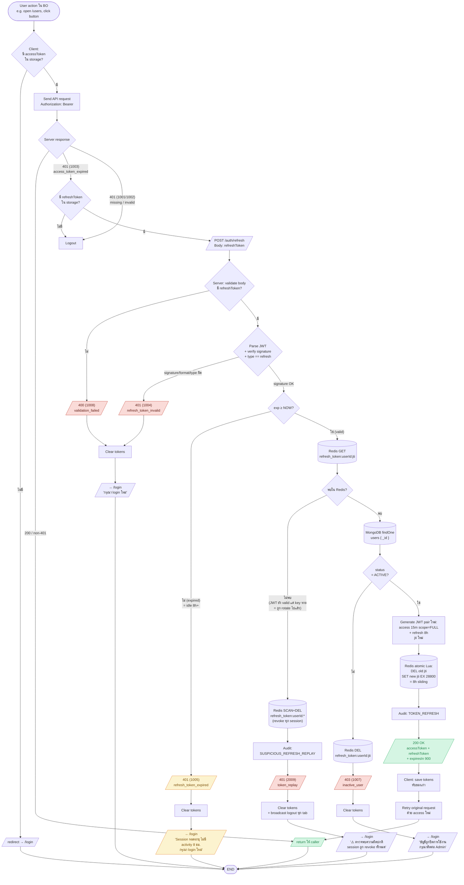
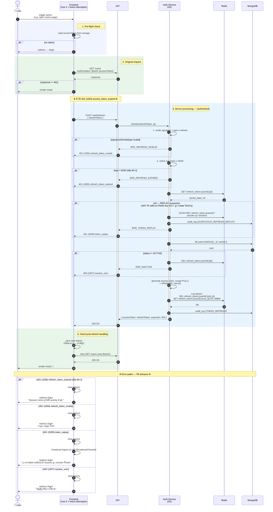

# POST /auth/refresh-token

ต่ออายุ access token ด้วย refresh token ใช้ **token rotation** — refresh token ตัวเก่าจะถูก revoke ทันทีหลังออกตัวใหม่ (ป้องกัน token replay)

---

## 1. Combined Flow — Client Trigger + Server Rotation

แสดงทั้ง **เงื่อนไขที่ client เรียก `/auth/refresh`** + **server processing** + **client handling ผลลัพธ์**

> **TTL:** Access 15 นาที, Refresh **8 ชั่วโมง (sliding)** — ทุกครั้งที่ refresh สำเร็จ → ได้ pair ใหม่ refresh TTL reset 8h เต็มจาก now (idle 8h+ = auto logout)



### 🚧 TODO: Single-flight lock (comment ไว้ในไดอะแกรม)

> Dev น่าจะรู้อยู่แล้ว — comment ไว้ใน diagram ก่อน implement จริง

ถ้า user คลิกเร็วๆ ตอน access หมดอายุ → หลาย requests ได้ 401 ขนานกัน → call `/auth/refresh` หลายตัวพร้อมกัน → ตัวที่ 2+ จะเจอ "old jti ไม่อยู่ใน Redis" → server ตีความว่า **REPLAY** → revoke ทุก session

**แก้:** FE ต้องมี in-memory mutex / promise queue ให้มี `/auth/refresh` เพียงตัวเดียวรันต่อเวลา ตัวอื่นรอผลลัพธ์แล้วใช้ token ใหม่ที่ rotate มา

### ลำดับการ check (สำคัญ!)

```
1. Verify signature + type   → 1004 ถ้าผิด
2. Check exp claim ≥ NOW     → 1005 ถ้าหมดอายุ (= idle 8h+)
3. Check Redis exists        → 2009 ถ้าไม่พบ (= replay)
4. MongoDB user status       → 1007 ถ้า inactive
```

> **ทำไม signature ก่อน exp?** — security best practice: ป้องกัน info leakage. ถ้าเช็ค exp ก่อน → attacker forge token ปลอม + ใส่ exp พ้น → server ตอบ "expired" → leak ว่าระบบไว้ใจ payload โดยไม่ verify

### 1004 / 1005 / 2009 — แยกกันยังไง?

| สาเหตุ | Signature | JWT exp | Redis key | Code |
|--------|-----------|---------|-----------|------|
| **Token ปลอม / format ผิด** | ผิด | (ไม่ได้เช็ค) | (ไม่ได้เช็ค) | **1004** `refresh_token_invalid` |
| **Idle 8h+** (BA requirement) | OK | < NOW (expired) | TTL หมด | **1005** `refresh_token_expired` |
| **Replay attack** | OK | ≥ NOW (valid) | ถูก DEL ตอน rotate | **2009** `token_replay` |

---

## 2. Combined Sequence Diagram — End-to-End



---

## 3. API Specification

### 3.1 Request

```http
POST /auth/refresh-token HTTP/1.1
Content-Type: application/json
```

```json
{
  "refreshToken": "eyJhbGciOiJIUzI1NiI..."
}
```

**Body fields:**
| Field | Type | Required | Description |
|-------|------|----------|-------------|
| `refreshToken` | string | ✅ | JWT refresh token ที่ได้จาก `/auth/login` หรือจาก refresh ครั้งก่อน |

> **หมายเหตุ:** ไม่ต้องส่ง `Authorization` header — access token อาจหมดอายุไปแล้ว

---

### 3.2 Response — 200 Refresh Success

```json
{
  "statusCode": "200",
  "code": "0000",
  "message": "Token refreshed successfully",
  "traceID": "5a132ae0-...",
  "responseTime": "2026-05-12T10:45:00.000+07:00",
  "data": {
    "accessToken": "eyJhbGciOiJIUzI1NiI... (new)",
    "refreshToken": "eyJhbGciOiJIUzI1NiI... (new)",
    "tokenScope": "FULL",
    "expiresIn": 900
  }
}
```

> **ข้อสำคัญ:** หลัง refresh สำเร็จ — frontend ต้องเก็บ `refreshToken` ตัวใหม่และทิ้งตัวเก่า เพราะตัวเก่าถูก revoke แล้ว

---

### 3.3 Error Responses

#### 400 Validation Failed
```json
{
  "statusCode": "400",
  "code": "1008",
  "error": "validation_failed",
  "message": "Refresh token is required",
  "traceID": "...",
  "responseTime": "2026-05-12T10:45:00.000+07:00",
  "data": {
    "errors": [{ "field": "refreshToken", "message": "required" }]
  }
}
```

#### 401 Invalid Refresh Token
```json
{
  "statusCode": "401",
  "code": "1004",
  "error": "refresh_token_invalid",
  "message": "Invalid or expired refresh token",
  "traceID": "...",
  "responseTime": "2026-05-12T10:45:00.000+07:00",
  "data": null
}
```

#### 401 Token Replay Detected
```json
{
  "statusCode": "401",
  "code": "2009",
  "error": "token_replay",
  "message": "Refresh token replay detected. All sessions have been revoked.",
  "traceID": "...",
  "responseTime": "2026-05-12T10:45:00.000+07:00",
  "data": null
}
```

> **Frontend behavior:** เมื่อได้ code `2009` (token_replay) → force logout ทุก tab + redirect ไปหน้า login + แสดง message แจ้งเตือนความปลอดภัย

#### 401 Account Inactive
```json
{
  "statusCode": "401",
  "code": "1007",
  "error": "inactive_user",
  "message": "บัญชีนี้ถูกปิดการใช้งาน",
  "traceID": "...",
  "responseTime": "2026-05-12T10:45:00.000+07:00",
  "data": null
}
```

---

## 4. Implementation Notes

### 4.1 Token Rotation = Security Best Practice

**ทำไมต้อง rotate:**
- ถ้า refresh token รั่ว → attacker จะ refresh ได้ครั้งเดียว ก่อนที่เจ้าของ token จะ refresh ครั้งถัดไป
- พอเจ้าของ refresh ครั้งถัดไป → ใช้ token เก่า (ที่ attacker ขโมยไป) จะถูก detect = REPLAY → revoke ทุก session

**Trade-off:** Refresh token หาย/ใช้ผิด session → user ต้อง login ใหม่ (acceptable trade-off สำหรับ BO ภายใน)

### 4.2 Go Service Signature

```go
type RefreshInput struct {
    RefreshToken string
    IP           string
}

type RefreshOutput struct {
    AccessToken  string
    RefreshToken string
    TokenScope   string
    ExpiresIn    int
}

func (s *AuthService) Refresh(ctx context.Context, in RefreshInput) (*RefreshOutput, error)
```

### 4.3 Atomic Rotation (Lua Script)

เพื่อป้องกัน race condition (2 refresh พร้อมกัน) — ใช้ Redis Lua script ให้ DEL old + SET new เป็น atomic:

```lua
-- KEYS[1] = refresh_token:{old_jti}
-- KEYS[2] = refresh_token:{new_jti}
-- ARGV[1] = new_data (JSON)
-- ARGV[2] = TTL

if redis.call('EXISTS', KEYS[1]) == 0 then
  return 'REPLAY'  -- old token ไม่มี = ถูกใช้ไปแล้ว
end

redis.call('DEL', KEYS[1])
redis.call('SET', KEYS[2], ARGV[1], 'EX', ARGV[2])
return 'OK'
```

### 4.4 Refresh = Sliding Window 8 ชั่วโมง

Refresh token ใหม่มี TTL **8 ชั่วโมงเต็ม** จากตอน rotate (sliding window) — ไม่ใช่จาก login เดิม

**ผลลัพธ์ตาม BA rule** ("ไม่ยิง API ใดๆ ภายใน 8 ชม. = auto logout"):
- **Active user** (มี API call ตลอด) → refresh slide ทุกครั้ง → session ไม่หมด
- **Idle user** (ไม่มี API call 8h+) → Redis TTL หมดอายุ + JWT exp ผ่าน → ครั้งต่อไปยิง refresh ได้ `401 (1005) refresh_token_expired` → force re-login

> **ไม่มี absolute max session cap** ในรอบนี้ — ตาม BA spec ตอนนี้  active session = ไม่จำกัด
> ถ้าอนาคตต้องการ "max session lifetime 12-24 ชม." — เก็บ `issuedAtOriginal` ใน JWT claims และเช็คตอน refresh
